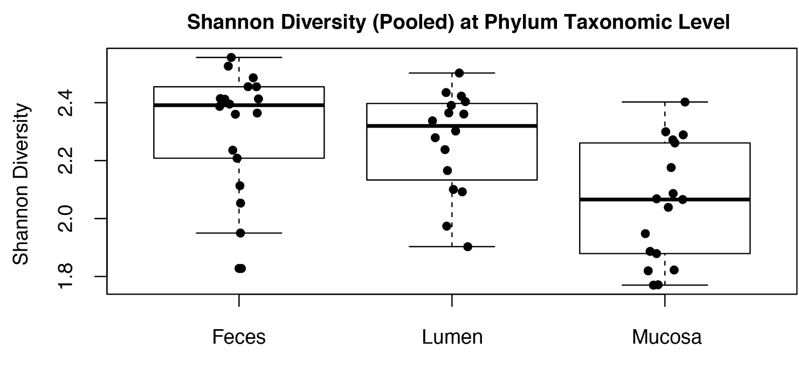

```{r setup, include=FALSE}
knitr::opts_chunk$set(echo = TRUE)
library("vegan")
library("stringr")
set.seed(574635409)
```

The metadata is in the output folder of the "ImportMetadata" module.
```{r}
pipeRoot="../.."
metaModule=dir(path=pipeRoot, pattern="ImportMetadata", full.names = TRUE, include.dirs = TRUE)
metaDir=dir(path=metaModule, pattern="output", full.names = TRUE, include.dirs = TRUE)
metaFile=dir(path=metaDir, full.names = TRUE, include.dirs = FALSE)
meta = read.table(metaFile, header=TRUE, row.names = 1)
levels(meta$tissue) = str_to_title(levels(meta$tissue))
metaFile
```

## Shannon diversity calculated from raw counts

The ShannonDiversity module calculates shannon diverstiy from the raw (unnormalized) counts.

```{r}
inputMod=dir(path=pipeRoot, pattern="ShannonDiversity", full.names = TRUE, include.dirs = TRUE)
inputDir=dir(path=inputMod, pattern="output", full.names = TRUE, include.dirs = TRUE)
diversityFile=dir(path=inputDir, pattern="phylum.tsv", full.names = TRUE, include.dirs = FALSE)
diversityFile
```


```{r}
level = gsub("[^?]*_taxaCount_shannon_|.tsv", "", diversityFile)
table = read.table(diversityFile, header = TRUE, row.names = 1)
merged = merge(meta, table, by = 0)
par(mar=c(3, 4, 3, 1))
title = paste0("Shannon Diversity (Pooled) at ", str_to_title(level), " Taxaonomic Level", collapse="")
boxplot(
  ShannonDiversity ~ tissue,
  data = merged,
  main = title,
  ylab = "Shannon Diversity"
)
points(
  x = jitter(as.numeric(merged$tissue)),
  y = merged$ShannonDiversity,
  pch = 19
)
mtext("(raw counts)", line=0, side=4)
```


## Shannon diversity calculated from log normalized counts

Here, shannon diversity is calculated from the log normalized counts (after normalization and log10-scaling).
This is matches the methods described in the methods of the Wilson et al 2018 paper.

```{r}
countsMod=dir(path=pipeRoot, pattern="LogTransformTaxaTables", full.names = TRUE, include.dirs = TRUE)
countsDir=dir(path=countsMod, pattern="output", full.names = TRUE, include.dirs = TRUE)
file=dir(path=countsDir, pattern="phylum.tsv", full.names = TRUE, include.dirs = FALSE)
file
```

```{r fig.height=5, fig.width=9}
level = gsub("[^?]*_taxaCount_norm_Log10_|.tsv", "", file)
table = read.table(file,
                   header = TRUE,
                   row.names = 1,
                   sep = "\t")
shann = apply(table, 1, diversity)
merged$shann = shann[merged$Row.names]
par(mar=c(3, 4, 3, 1))
title = paste0("Shannon Diversity (Pooled) at ", str_to_title(level), " Taxaonomic Level", collapse="")
boxplot(shann ~ tissue,
        data = merged,
        main = title,
        ylab = "Shannon Diversity")
points(x = jitter(as.numeric(merged$tissue)),
       y = merged$shann,
       pch = 19)
mtext("(normalized log10-scaled counts)", line=0, side=4)
```


## Original: Supplemental Figure 1



This figure is reproduced from:

**Wilson, Q.N., Wells, M., Davis, A.T. et al. Greater Microbial Translocation and Vulnerability to Metabolic Disease in Healthy Aged Female Monkeys. Sci Rep 8, 11373 (2018). https://doi.org/10.1038/s41598-018-29473-9**

See supplemental: https://static-content.springer.com/esm/art%3A10.1038%2Fs41598-018-29473-9/MediaObjects/41598_2018_29473_MOESM1_ESM.pdf


# Conclusion

Using the methods described by the authors, we were able to reproduce this figure. The subtle differences in values could be attributed to differences in sequence pre-processing.
